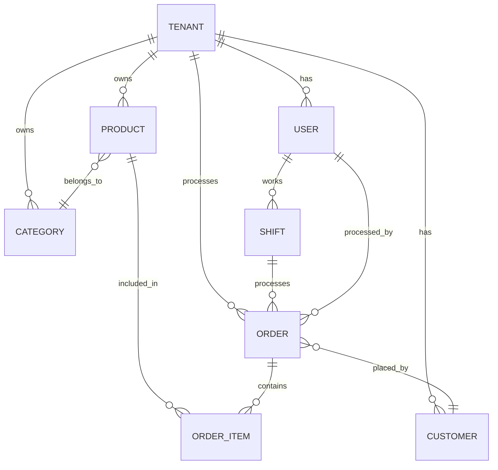

# Alswap Inventory - Architecture Overview

> **Last Updated**: 2026-07-21

## Codebase Summary

Alswap Inventory is a **Next.js (App Router)** application providing inventory management, point-of-sale (POS), and analytics capabilities with offline-first support.

---

## Technology Stack

| Layer               | Technology                                               |
| ------------------- | -------------------------------------------------------- |
| **Framework**       | Next.js 14 (App Router)                                  |
| **Language**        | TypeScript (strict)                                      |
| **Styling**         | Tailwind CSS                                             |
| **State/Fetching**  | TanStack Query via tRPC                                  |
| **Database ORM**    | Drizzle ORM with Postgres.js or Neon WebSocket transport |
| **Offline Storage** | Dexie.js (IndexedDB)                                     |
| **Charts**          | Recharts                                                 |
| **Forms**           | React Hook Form + Zod                                    |
| **Icons**           | Lucide React                                             |

---

## Directory Structure

```
src/
├── app/                    # Next.js App Router pages
│   ├── (auth)/             # Auth pages (signin, signup, etc.)
│   ├── (dashboard)/        # Protected dashboard routes
│   ├── api/                # Next.js API routes
│   ├── inventory/          # Inventory management pages
│   ├── pos/                # Point-of-sale pages
│   └── sales/              # Sales & history pages
├── components/             # Shared UI components
│   ├── ui/                 # Base UI primitives
│   └── [feature]/          # Feature-specific components
├── hooks/                  # Custom React hooks
├── lib/                    # Utilities (db, export, fuzzy-match)
├── server/
│   ├── api/
│   │   ├── routers/        # tRPC routers
│   │   ├── root.ts         # Root router
│   │   └── trpc.ts         # tRPC config
│   └── db/                 # Drizzle schema & client
└── trpc/                   # tRPC client setup
```

---

## Key Data Flows

### 1. POS Offline Sync Flow

```
[User Action] → [Dexie (IndexedDB)] → [usePosSync hook]
                      ↓                       ↓
              [Local Storage]          [tRPC sync]
                                             ↓
                                      [Server DB]
```

- **Offline**: Transactions stored in Dexie
- **Online**: `usePosSync` pushes pending transactions to server
- **Conflict Resolution**: Server timestamp takes precedence

### 2. Authentication Flow

```
[SignIn/SignUp] → [NextAuth] → [Session Cookie]
                       ↓
              [tRPC protectedProcedure]
                       ↓
              [Authorized API Access]
```

### 3. Data Fetching Pattern

```
[Page Component] → [tRPC useQuery] → [tRPC Router]
                         ↓                  ↓
                   [React Query]      [Drizzle ORM]
                   [Cache]                  ↓
                                      [Database]
```

### 4. Database Transport

- `DATABASE_TRANSPORT=tcp` uses Postgres.js and remains the production default.
- `DATABASE_TRANSPORT=websocket` uses the Neon serverless driver over port 443 for local networks that block PostgreSQL TCP/5432.
- Both transports expose the same Drizzle database interface, including relational queries and interactive transactions.
- Drizzle Kit commands still connect directly over PostgreSQL TCP and may require a network that permits port 5432.

---

## Entity Relationships



### Core Entities

| Entity        | Description                                 |
| ------------- | ------------------------------------------- |
| **Tenant**    | Multi-tenant isolation (shop/business)      |
| **User**      | Staff members (roles: admin, cashier, etc.) |
| **Product**   | Inventory items with stock tracking         |
| **Category**  | Product categorization                      |
| **Customer**  | Customer records for loyalty/history        |
| **Order**     | Sales transactions                          |
| **OrderItem** | Line items in an order                      |
| **Shift**     | POS shift tracking                          |

---

## Key Modules

### Inventory Management (`/inventory`)

- Product CRUD with stock tracking
- Category management
- Bulk import/export
- Low stock alerts

### Point of Sale (`/pos`)

- Offline-first transaction processing
- Shift management
- Receipt generation
- Customer lookup

### Analytics (`/inventory/analytics`)

- Sales trends (daily/weekly/monthly)
- Top products & categories
- Revenue & profit KPIs
- AI-generated insights

### Settings (`/inventory/settings`)

- Store configuration
- Currency settings
- User management
- Integrations

---

## Documentation Index

| Area         | Location           |
| ------------ | ------------------ |
| Pages        | `docs/pages/`      |
| API Routes   | `docs/api/routes/` |
| tRPC Routers | `docs/api/trpc/`   |
| Components   | `docs/components/` |
| Hooks        | `docs/hooks/`      |

---

## Update Log

| Date       | Change                                                      |
| ---------- | ----------------------------------------------------------- |
| 2026-07-21 | Added selectable TCP and Neon WebSocket database transports |
| 2026-01-07 | Initial overview created                                    |
